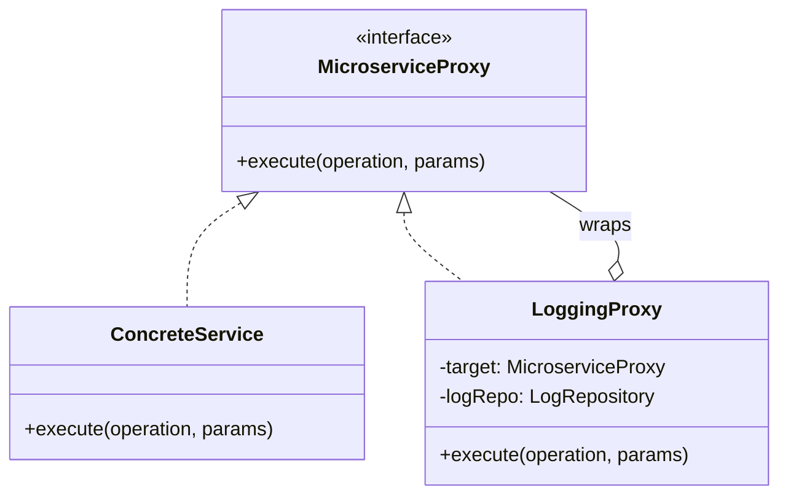

# Proxy Boot - Backend

Backend implementation for the microservices monitoring system using the **Proxy Pattern**.

## Design Pattern: Proxy
The Proxy Pattern is used here to intercept calls to three core services (`Inventory`, `Orders`, `Payments`). 

- **LoggingProxy**: Acts as a decorator that adds logging and execution time tracking without modifying the business logic of the concrete services.
- **Fail-Safe Processing**: The proxy ensures that even if a service fails (like the intentional 10% failure in Payments), the meta-data is captured.

## Technology Stack
- **Spring Boot 3.4**: Core framework.
- **Spring Data JPA**: Persistence using H2.
- **SpringDoc OpenAPI (Swagger)**: API documentation.
- **H2 File Persistence**: Data is saved in `./data/monitoring`.

## Getting Started
1. Navigate to the `backend` folder.
2. Run `./mvnw spring-boot:run` or `mvn spring-boot:run`.
3. Access **Swagger UI** at: `http://localhost:8080/swagger-ui.html`.
4. API endpoints are under `/api/services` and `/api/metrics`.

## Highlights
- **Clean Architecture**: Decoupled layers (Domain, Application, Infrastructure).
- **Atomic Persistence**: Logs are saved in real-time.
- **Generics**: The `MicroserviceProxy<T>` is designed to handle any return type.
