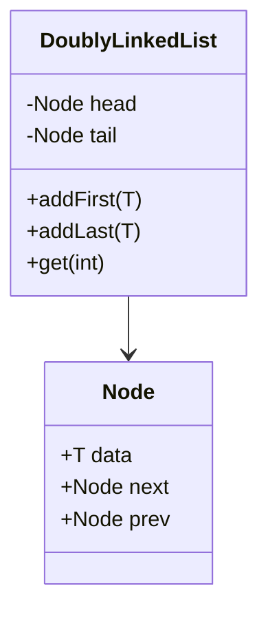

# Proxy Boot - Backend

Backend implementation for the microservices monitoring system.

## Design Patterns & Data Structures

### 1. Proxy Pattern
Used to intercept calls to core services. The `LoggingProxy` captures metadata, performance, and errors without altering business logic.

### 2. Doubly Linked List (Lista Doblemente Enlazada)
Para cumplir con los requerimientos académicos de estructuras de datos, se implementó una **Lista Doblemente Enlazada** (`DoublyLinkedList<T>`).

- **Uso**: Se utiliza para gestionar el búfer de logs recientes en memoria.
- **Ventaja**: Permite navegar bidireccionalmente por los eventos capturados por el Proxy de forma eficiente, facilitando la implementación de la paginación y la visualización de "anterior/siguiente" en la auditoría.

## Technology Stack
- **Spring Boot 3.4**
- **Spring Data JPA & H2** (Persistencia en archivo)
- **SpringDoc OpenAPI (Swagger)**

## Acceso
- **Swagger UI**: `http://localhost:8080/swagger-ui.html`
