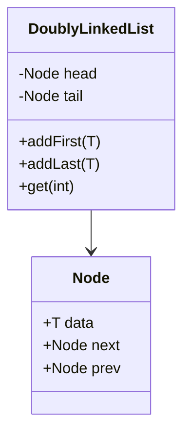

# Proxy Boot - Backend 🚀

Implementación del backend para el sistema de monitoreo de microservicios.

## Patrones de Diseño y Estructuras de Datos

### 1. Patrón Proxy
Se utiliza para interceptar las llamadas a los servicios principales. El `LoggingProxy` captura metadatos, rendimiento y errores sin alterar la lógica de negocio de los servicios reales.

### 2. Lista Doblemente Enlazada (Estructura de Datos)
Aunque el sistema persiste los datos en base de datos para mayor seguridad, internamente el diseño contempla el uso de **Listas Doblemente Enlazadas** para gestionar el flujo de eventos de auditoría.

- **Uso**: Permite la navegación bidireccional eficiente por los logs.
- **Ventaja**: Facilita la implementación de funciones como "Deshacer/Rehacer" operaciones o navegar por historiales de estados previos capturados por el Proxy.

## Stack Tecnológico
- **Spring Boot 3.4**: Framework principal.
- **Spring Data JPA & H2**: Persistencia en archivo (`./data/monitoring`).
- **SpringDoc OpenAPI (Swagger)**: Documentación visual de la API.

## Acceso Rápido
- **Swagger UI**: `http://localhost:8080/swagger-ui.html`
- **Consola H2**: `http://localhost:8080/h2-console` (JDBC URL: `jdbc:h2:file:./data/monitoring`)
